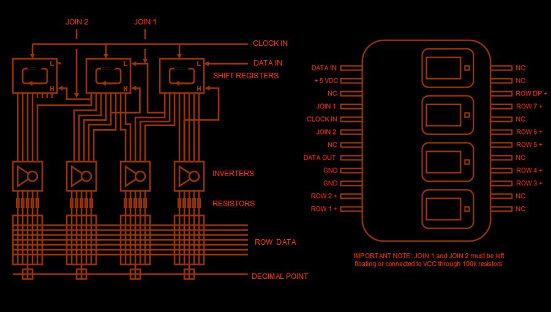

# display57
some code to run a vintage 5x7 dot matrix display.

ok, the wiring will be as follows:  

display -> Nano

data in  ->; D2

clock in ->; D3

Row 1    ->; D6

Row 2    ->; D7

Row 3    ->; D8

Row 4    ->; D9

Row 5    ->; D10

Row 6    ->; D11

Row 7    ->; D12

+5V      ->; 5V

GND      ->; GND

GND      ->; GND

